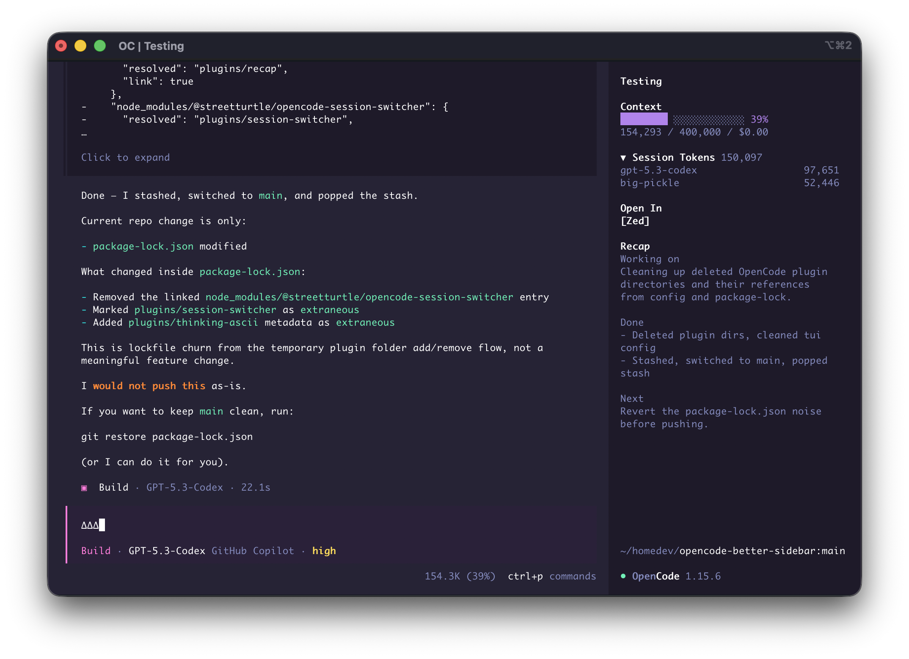

# opencode-better-sidebar

Small, focused OpenCode sidebar plugins that make daily coding sessions faster.

If this helps your workflow, please star the repo.

<p align="center">
  
</p>

## Install all plugins (one command)

```sh
for p in @streetturtle/opencode-open-in @streetturtle/opencode-context-progress @streetturtle/opencode-recap @streetturtle/opencode-session-tokens; do opencode plugin --global "$p"; done
```

Per-project install (without `--global`):

```sh
for p in @streetturtle/opencode-open-in @streetturtle/opencode-context-progress @streetturtle/opencode-recap @streetturtle/opencode-session-tokens; do opencode plugin "$p"; done
```

## Plugin Pack

- `@streetturtle/opencode-open-in` - quick buttons to open the current session folder in Zed, VS Code, or Cursor.
- `@streetturtle/opencode-context-progress` - context usage progress bar with token usage, window limit, and spend.
- `@streetturtle/opencode-recap` - one-click AI recap for the current session.
- `@streetturtle/opencode-session-tokens` - collapsible session token totals with per-model breakdown.

## Publishing

This repo publishes each plugin as its own npm package via GitHub Actions.

Required GitHub secret:

- `NPM_TOKEN` (npm automation token with publish access to `@streetturtle/*`)

Security notes:

- Use an npm automation token scoped only to publish `@streetturtle/opencode-*`
- Enable npm 2FA for account settings and token creation
- Workflow publishes only packages named `@streetturtle/opencode-*`
